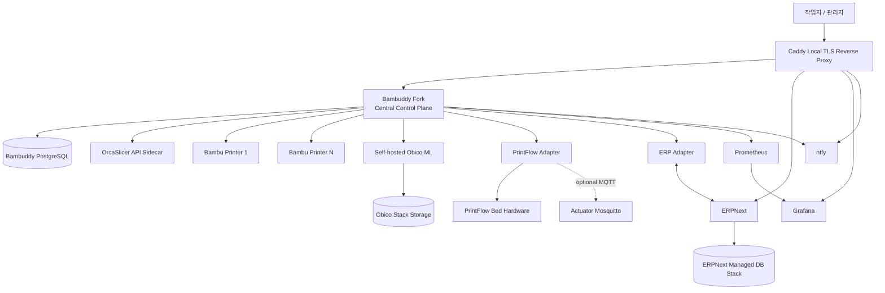
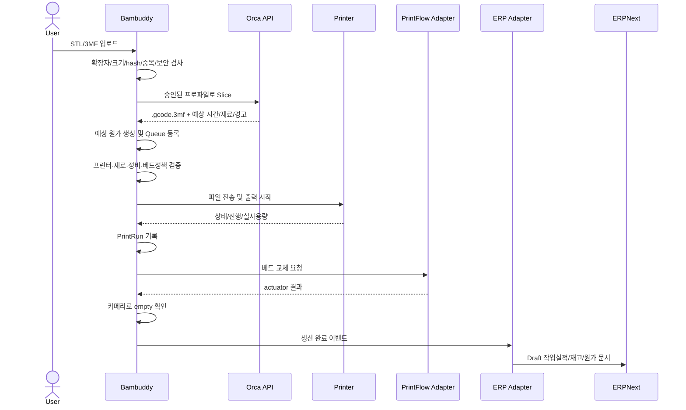
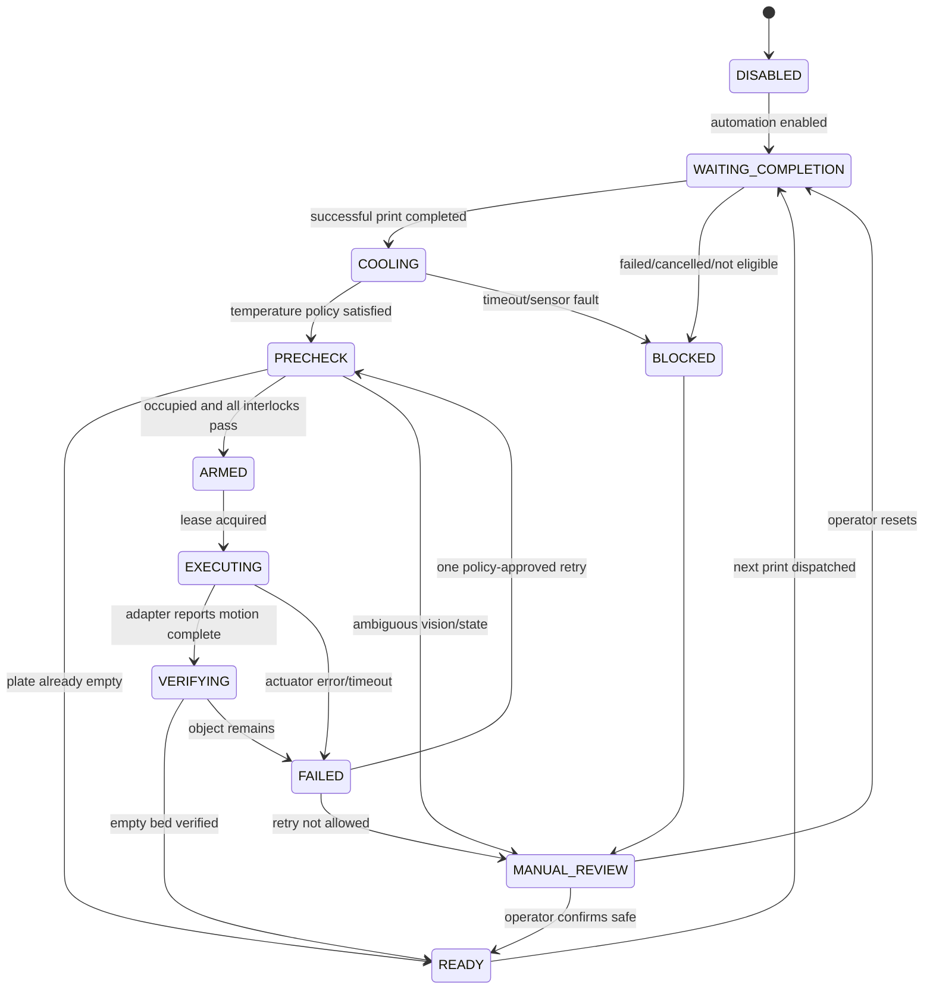

# 3D 프린팅 팜 통합 운영 시스템
## Codex 최종 개발 명세서

- 문서 버전: 1.1
- 기준일: 2026-06-18
- 기준 시간대: Asia/Seoul
- 프로젝트 소유자: Fuzzyline Studio
- 중앙 플랫폼: `maziggy/bambuddy` Fork
- 기본 슬라이서: OrcaSlicer CLI via Bambuddy `slicer-api`
- 배포 원칙: 100% 로컬 우선, LAN Only
- 구현 방식: 기존 Bambuddy 기능 최대 활용 + 최소 침습 확장
- 소스 관리: 모든 애플리케이션급 오픈소스 모듈을 조직 Fork로 등록하고, 업스트림 미러와 커스텀 통합 브랜치를 분리
- UI 정책: **초기에는 Bambuddy 기본 UI를 그대로 사용한다.**
- 중요도 표기: `MUST`, `SHOULD`, `MAY`

---

# 0. Codex에게 주는 최상위 지시

이 문서는 본 프로젝트의 규범적 개발 명세다.

Codex는 코드를 작성하기 전에 반드시 다음을 수행한다.

1. 현재 Fork 저장소의 `README.md`, `CONTRIBUTING.md`, Docker 구성, DB 모델, API 라우트, OpenAPI/API Browser, 테스트 구조를 먼저 조사한다.
2. 이 문서의 요구사항과 Bambuddy 기존 구현을 비교하여 `docs/farm/GAP_ANALYSIS.md`를 만든다.
3. Bambuddy에 이미 존재하는 기능은 새로 구현하지 않는다.
4. 기존 모델·서비스·API를 재사용하고, 중복되는 “두 번째 큐”, “두 번째 스풀 원장”, “두 번째 프린터 상태 관리자”를 만들지 않는다.
5. Phase 1에서는 프런트엔드 UI를 수정하지 않는다.
6. 모든 프린터 상태 변경 명령은 Bambuddy 내부에서만 최종 승인·실행한다.
7. 한 번에 전체 기능을 구현하지 말고 이 문서의 Work Package 순서대로 작은 PR로 나눈다.
8. 모든 PR은 테스트, 마이그레이션, 롤백 방법, 문서 갱신을 포함해야 한다.
9. 실제 PrintFlow 장치 명령이나 센서 규격이 확인되지 않은 부분을 추측으로 구현하지 않는다. 드라이버 인터페이스와 시뮬레이터를 먼저 만들고, 실제 하드웨어 매핑은 장치 문서와 현장 시험 후 추가한다.
10. 버전 태그와 이미지 digest를 고정한다. 운영 환경에서 `latest` 태그를 사용하지 않는다.

Codex가 처음 수행할 작업은 **WP-00과 WP-01뿐**이다. 한 PR에 여러 Work Package를 섞지 않는다.

---

# 1. 프로젝트 목표

Bambu Lab 프린터 여러 대를 로컬 네트워크에서 24시간 운영하는 생산 팜 시스템을 구축한다.

시스템은 다음을 제공해야 한다.

- 모델 업로드, 서버 슬라이싱, 생산 작업 생성
- 프린터 상태 수집 및 중앙 대시보드
- 작업 큐, 예약, 배치, 자동 할당
- 필라멘트 검증 및 실제 사용량 기록
- 출력 성공·실패·재출력 이력
- AI 기반 출력 실패 감시
- 상황 기반 자동 베드 교체
- ERPNext와 주문·생산·재고·회계 데이터 연동
- 예상 원가와 실제 원가 및 차이 분석
- Prometheus/Grafana 기반 생산·설비 모니터링
- 로컬 알림, 백업, 감사 로그, 장애 복구
- 사람이 개입하지 않아도 안전하게 반복 가능한 생산 사이클

핵심 목표는 “모든 것을 자동으로 움직이는 것”이 아니라 다음 세 가지다.

1. 잘못된 작업이 시작되지 않는다.
2. 장애가 발생했을 때 원인과 비용을 추적할 수 있다.
3. 물리 상태가 불확실할 때 자동화가 멈추고 사람에게 판단을 넘긴다.

---

# 2. 확정된 아키텍처 결정

## ADR-001 — Bambuddy가 단일 중앙 제어 시스템이다

Bambuddy Fork는 다음 데이터와 의사결정의 최종 권한을 가진다.

- 프린터 등록과 연결 상태
- 프린터별 현재 작업
- 작업 큐와 스케줄
- 프린터 할당
- 프린트 시작·일시정지·재개·취소
- 출력 파일 전송
- 출력 실행 이력
- 작업 성공·실패 상태
- 스풀 사용량과 운영 원가
- AI 감시 결과
- 베드 자동화 상태
- 다음 작업을 시작해도 되는지에 대한 최종 판단

외부 모듈은 Bambuddy에 요청하거나 이벤트를 보고할 수 있지만, 프린터에 직접 명령하지 않는다.

```text
외부 모듈
    │ REST API / Webhook
    ▼
Bambuddy
    ├─ 인증/권한
    ├─ 현재 상태 검증
    ├─ 작업/프린터 잠금
    ├─ 안전 정책 검증
    ├─ 명령 기록
    └─ 실제 프린터 명령
          │ MQTT / FTPS / Bambu 프로토콜
          ▼
      Bambu Printer
```

### 유일한 예외

화재, 누전, 과전류, 비상정지 버튼 같은 물리 안전장치는 Bambuddy를 거치지 않고 전원을 차단할 수 있다. 차단 후 Bambuddy에는 안전 이벤트를 보고한다.

---

## ADR-002 — Bambuddy UI를 그대로 사용한다

초기 개발 단계에서는 기존 Bambuddy UI를 변경하지 않는다.

- 메뉴 재배치 금지
- 대시보드 재작성 금지
- 신규 ERP 화면 추가 금지
- 신규 베드 교체 화면 추가 금지
- CSS·테마 커스텀 금지

운영하면서 실제 불편이 누적되고, 사용 빈도와 작업자 피드백이 확보된 뒤 별도 UI 개선 요구사항으로 분리한다.

초기 신규 기능은 다음 방법으로 운영한다.

- 환경변수 및 설정 파일
- Bambuddy 기존 Settings
- 기존 API Browser/OpenAPI
- 기존 알림과 로그
- Grafana 대시보드
- ERPNext 자체 UI

---

## ADR-003 — OrcaSlicer CLI만 사용한다

Bambu Studio CLI는 초기 구성에서 사용하지 않는다.

Bambuddy의 기존 `slicer-api` sidecar를 이용하여 OrcaSlicer CLI를 HTTP 서비스로 실행한다.

```text
Bambuddy File Manager
    │ Slice 요청
    ▼
orca-slicer-api
    │ OrcaSlicer CLI
    ▼
.gcode.3mf + 슬라이싱 메타데이터
    │
    ▼
Bambuddy Library / Queue
```

Orca sidecar는 오직 다음만 담당한다.

- STL/3MF 입력
- 승인된 프린터·공정·필라멘트 프로파일 로딩
- 슬라이싱
- `.gcode.3mf` 생성
- 예상 시간, 필라멘트 사용량, 플레이트 정보, 경고 반환

Orca sidecar는 다음을 하면 안 된다.

- 프린터에 파일 직접 전송
- 출력 직접 시작
- Bambu MQTT publish
- 프린터 pause/resume/stop
- 베드 교체 G-code 직접 발송

MVP 공식 입력 형식은 `STL`과 `3MF`다. STEP/STP는 Bambuddy의 완전한 처리 경로가 검증되지 않았으므로 MVP 범위에서 제외한다. 향후 필요하면 별도의 FreeCAD headless 변환 서비스로 STEP → STL/3MF 변환을 추가한다.

---

## ADR-004 — ERPNext를 업무·재무 원장으로 사용한다

ERPNext를 별도 로컬 스택으로 배포한다.

역할 분리는 다음과 같다.

| 영역 | 최종 원장 |
|---|---|
| 프린터 상태, 큐, 출력 실행 | Bambuddy |
| 출력 이력, 실패, 실제 필라멘트·전력·시간 | Bambuddy |
| 고객, 견적, 판매주문, 납기 | ERPNext |
| SKU, BOM, 생산계획, 작업지시 | ERPNext |
| 구매, 창고재고, 완제품 입출고 | ERPNext |
| 청구, 매출, 비용, 총계정원장 | ERPNext |
| 두 시스템 간 ID·재시도·동기화 | ERP Adapter |

ERPNext는 프린터에 직접 명령하지 않는다.

초기에는 ERP 연동이 생성하는 회계·재고 문서를 `Draft`로 저장하고 사람이 승인한다. 대조 검증이 끝난 이후에만 자동 제출을 활성화한다.

한국 세금계산서, 부가세 신고, 법정 장부 반영은 회계 담당자의 검증 없이 자동화하지 않는다.

---

## ADR-005 — 스풀 원장을 중복 운영하지 않는다

초기에는 별도 Spoolman 컨테이너를 배포하지 않는다.

이유:

- Bambuddy에 스풀 재고·AMS 할당·사용량·원가 기능이 이미 있다.
- ERPNext도 구매 및 회계 재고를 보유한다.
- Spoolman까지 동시에 사용하면 세 개 시스템에서 수량이 달라질 수 있다.

역할은 다음처럼 고정한다.

- Bambuddy: 프린터에 실제 장착된 스풀, 잔량, 출력별 실제 사용량
- ERPNext: 구매 입고, 창고 재고 가치, 회계상 재고
- ERP Adapter: 스풀/로트 매핑과 소비량 전송

Spoolman은 향후 외부 장비나 다중 제조사 프린터 때문에 꼭 필요해질 때만 추가하며, 그때도 하나의 재고 원장을 명시한다.

---

## ADR-006 — Home Assistant와 Node-RED는 핵심 생산 경로에서 제외한다

### Home Assistant

초기 필수 구성에서 제외한다. 향후 다음 시설 자동화에만 사용할 수 있다.

- 실내 온습도
- VOC/미세먼지
- 환기·공조
- 화재·누수·문 열림
- 스마트플러그·전력계
- 시설 알림

Home Assistant는 프린터 작업을 시작하거나 베드를 교체하지 않는다.

### Node-RED

프로토타입에는 사용할 수 있지만, 생산 베드 교체의 최종 로직으로 사용하지 않는다. 안전 상태 머신과 장애 복구가 필요한 로직은 Python 코드와 DB 트랜잭션으로 구현한다.

---

## ADR-007 — 별도 Bambu MQTT Bridge를 두지 않는다

Bambuddy가 프린터와 직접 통신한다.

외부 모듈이 프린터 telemetry를 필요로 하면 다음을 이용한다.

- Bambuddy REST API
- Bambuddy Webhook/Event
- Bambuddy Prometheus metrics
- Bambuddy의 선택적 MQTT publishing

PrintFlow 하드웨어 자체가 MQTT를 요구하는 경우에만 별도의 Mosquitto를 `actuator broker`로 선택 배포한다. 이 브로커는 Bambu 프린터 명령 경로가 아니며 ACL로 PrintFlow 전용 topic만 허용한다.

---

## ADR-008 — InfluxDB는 사용하지 않는다

Bambuddy가 Prometheus metrics를 제공하므로 다음을 사용한다.

- Prometheus: 메트릭 수집
- Grafana: 대시보드·알람
- PostgreSQL: 업무 상태·트랜잭션 데이터
- Bambuddy 로그: 애플리케이션 진단

동일 데이터를 InfluxDB에도 중복 저장하지 않는다.

---


## ADR-009 — 모든 애플리케이션급 오픈소스 모듈을 Fork로 등록한다

Bambuddy뿐 아니라 OrcaSlicer 계열, ERPNext/Frappe, Obico, Prometheus,
Grafana, ntfy, Caddy, 선택적 Mosquitto도 조직 계정 아래 Fork로 등록한다.

단, **Fork를 만들었다고 모든 코어 소스를 수정하지 않는다.**

Fork는 다음 세 종류로 관리한다.

| 종류 | 의미 | 예시 |
|---|---|---|
| Product Fork | 실제 커스텀 코드가 들어가는 Fork | Bambuddy, 필요 시 orca-slicer-api |
| Extension Fork | 업스트림 코어는 보존하고 별도 앱·어댑터로 확장 | ERPNext/Frappe, Obico |
| Mirror Fork | 소스 감사·업데이트 추적·재현성을 위한 미러. 코어 수정 금지 | Prometheus, Grafana, ntfy, Caddy, Mosquitto, OrcaSlicer |

PostgreSQL, Redis, 운영체제 베이스 이미지처럼 애플리케이션 커스텀 대상이
아닌 기반 의존성은 무조건 Fork하지 않는다. 이들은 이미지 digest와 버전을
`components.lock.yaml`에서 고정하고 공급망 검사 대상으로 관리한다.

---

## ADR-010 — 업스트림 업데이트는 AI 보조 PR로 통합한다

업스트림 Fork의 `main`은 원본과 동일하게 유지하고, 실제 커스텀 운영 코드는
`farm-main`에 둔다.

업데이트 흐름은 다음과 같다.

```text
upstream release
    ↓
Fork main 동기화
    ↓
integration/upstream-<version> 브랜치 생성
    ↓
main을 farm-main에 병합
    ↓
변경 파일·API·DB migration·dependency·custom overlap 자동 분석
    ↓
Codex가 AGENTS.md와 커스텀 변경 장부를 읽고 영향 보고서 및 보정 코드 작성
    ↓
기존 테스트 + 커스텀 테스트 + contract test + simulator
    ↓
사람의 코드 리뷰
    ↓
staging / canary
    ↓
farm-main 병합, 내부 release tag 및 image digest 고정
```

AI는 업데이트를 자동 승인하는 주체가 아니다. AI의 역할은 변경 영향 분석,
충돌 해결 초안, 테스트 보정, 문서 갱신이다. 프린터 제어, 베드 자동화,
ERP 재고·회계 posting에 영향을 주는 변경은 반드시 사람이 승인한다.

---

# 3. 최종 시스템 구성

## 3.1 논리 아키텍처



## 3.2 물리 배포 및 저장소 구성

실행 환경은 세 개의 Compose 프로젝트로 분리하고, 소스 관리는 중앙
`farm-platform` 저장소와 각 모듈 Fork로 나눈다.

### A. `<ORG>/farm-platform`

직접 작성하는 원본 저장소다.

- 전체 구성요소 버전과 commit/image digest lock
- Docker Compose override
- Caddy 설정
- Prometheus 설정
- Grafana provisioning/dashboard
- ntfy 설정
- 네트워크·secret·backup 정책
- 환경별 배포 파일
- multi-repo integration test
- upstream update orchestration 문서
- 공통 Codex prompt와 manifest schema

이 저장소는 각 애플리케이션의 코어 소스를 복사하지 않는다.

### B. `farm-core` Compose

- `<ORG>/bambuddy` Product Fork
- `<ORG>/orca-slicer-api` Product/Compatibility Fork
- Bambuddy PostgreSQL
- `<ORG>/farm-erp-adapter`
- `<ORG>/farm-printflow-adapter`
- Prometheus
- Grafana
- ntfy
- Caddy
- 선택적 Mosquitto

Prometheus, Grafana, ntfy, Caddy, Mosquitto는 조직 Fork로 업데이트를
추적하지만, 운영 커스텀 설정은 `farm-platform`에 둔다.

### C. `erpnext` Compose

다음 Fork를 사용한다.

- `<ORG>/frappe`
- `<ORG>/erpnext`
- `<ORG>/frappe_docker`

커스텀 ERP 로직은 ERPNext 코어에 직접 넣지 않고 별도 원본 저장소인
`<ORG>/farm-erpnext-app`에 작성한다.

- Custom DocType
- Custom Field/Fixture
- Hook
- Report
- Integration setting
- ERP Adapter용 API
- 권한 및 migration

ERPNext/Frappe 업스트림 Fork는 가능한 한 순수 미러로 유지한다.

### D. `obico` Compose

- `<ORG>/obico-server` Fork
- 공식 self-hosted 구성을 기준으로 한 overlay
- GPU가 있으면 별도 GPU 노드 배포 가능

초기에는 Obico 코어를 수정하지 않고 Bambuddy 내장 integration을 사용한다.
커스텀이 필요하면 먼저 외부 adapter 또는 configuration으로 해결한다.

### E. 조직 Fork 카탈로그

| 내부 저장소 | 원본 저장소 | 기본 운영 방식 |
|---|---|---|
| `<ORG>/bambuddy` | `maziggy/bambuddy` | Product Fork |
| `<ORG>/orca-slicer-api` | `maziggy/orca-slicer-api` | Product/Compatibility Fork |
| `<ORG>/OrcaSlicer` | `OrcaSlicer/OrcaSlicer` | Mirror Fork |
| `<ORG>/frappe` | `frappe/frappe` | Extension Fork, 코어 수정 최소화 |
| `<ORG>/erpnext` | `frappe/erpnext` | Extension Fork, 별도 custom app |
| `<ORG>/frappe_docker` | `frappe/frappe_docker` | Deployment Mirror Fork |
| `<ORG>/obico-server` | `TheSpaghettiDetective/obico-server` | Extension/Mirror Fork |
| `<ORG>/prometheus` | `prometheus/prometheus` | Mirror Fork |
| `<ORG>/grafana` | `grafana/grafana` | Mirror Fork |
| `<ORG>/ntfy` | `binwiederhier/ntfy` | Mirror Fork |
| `<ORG>/caddy` | `caddyserver/caddy` | Mirror Fork |
| `<ORG>/mosquitto` | `eclipse-mosquitto/mosquitto` | 선택적 Mirror Fork |

`<ORG>`는 실제 GitHub Organization 이름으로 치환한다.

이 분리는 업데이트·장애·라이선스·백업·릴리스 범위를 명확히 하기 위한 것이다.

---

# 4. 서버와 네트워크 기준

## 4.1 CPU 아키텍처

OrcaSlicer sidecar는 현재 `linux/amd64`를 기준으로 운영한다. 따라서 Core 서버는 x86_64 미니 PC 또는 서버를 사용한다.

ARM NAS를 메인 서버로 사용할 경우:

- Bambuddy는 ARM에서 실행 가능하더라도
- Orca sidecar는 별도의 x86_64 노드에서 실행하고
- Bambuddy가 LAN URL로 호출한다.

## 4.2 초기 용량 가이드

다음은 구매 확정 사양이 아니라 파일럿 시작점이다. 실제 카메라 수, 모델 크기, 슬라이싱 병렬도, 보존 기간으로 벤치마크한다.

| 규모 | Core 서버 시작점 |
|---|---|
| 1~5대 | x86_64 4코어, RAM 16GB, NVMe 500GB |
| 6~20대 | x86_64 8코어, RAM 32GB, NVMe 1TB |
| 20~40대 | 8코어 이상, RAM 32~64GB, NVMe 1TB 이상, AI 별도 노드 권장 |

필수 권장:

- UPS
- NVMe 상태 모니터링
- NAS 또는 별도 백업 대상
- 서버와 프린터 고정 DHCP reservation
- 예비 네트워크 스위치/케이블
- 운영 서버와 테스트 서버 또는 최소한 canary 프린터

## 4.3 네트워크 분리

권장 VLAN:

```text
VLAN 10  Management
VLAN 20  Farm Servers
VLAN 30  Bambu Printers
VLAN 40  Facility IoT
```

방화벽 원칙:

- 작업자 → Caddy/Bambuddy/ERP/Grafana만 허용
- Bambuddy → 프린터 필수 포트만 허용
- 프린터 → 인터넷 기본 차단
- 프린터 → Bambuddy 응답 트래픽만 허용
- ERP Adapter → Bambuddy와 ERPNext만 허용
- PrintFlow Adapter → Bambuddy와 actuator만 허용
- Prometheus → metrics endpoint만 허용
- DB 포트는 사용자 VLAN에 노출하지 않음

프린터 검색 편의보다 보안을 우선한다. Linux 운영에서는 Docker bridge 네트워크와 수동 IP 등록을 기본으로 한다. SSDP 자동 검색이나 Virtual Printer 기능 때문에 host network가 꼭 필요한 경우에만 별도 보안 검토 후 사용한다.

---

# 5. Multi-Fork 및 AI 업데이트 운영 전략

## 5.1 목표

이 전략의 목표는 다음 세 가지를 동시에 만족하는 것이다.

1. 업스트림의 신규 기능·버그 수정·보안 패치를 계속 받을 수 있다.
2. Fuzzyline Studio의 커스텀 기능이 업스트림 코드와 섞여 사라지지 않는다.
3. 업스트림 업데이트 때 Codex가 변경 영향을 재현 가능하게 분석하고 필요한
   보정 코드를 작성할 수 있다.

Fork 자체만으로는 이 목표가 달성되지 않는다. 반드시 브랜치 분리,
커스텀 변경 장부, contract test, 중앙 lock 파일, 사람의 승인 절차가 함께
있어야 한다.

## 5.2 조직 저장소 구조

```text
<ORG>/
├── .github or farm-workflows
├── farm-platform
├── farm-contracts
├── farm-erpnext-app
├── farm-erp-adapter
├── farm-printflow-adapter
│
├── bambuddy                 # Fork
├── orca-slicer-api          # Fork
├── OrcaSlicer               # Fork
├── frappe                   # Fork
├── erpnext                  # Fork
├── frappe_docker            # Fork
├── obico-server             # Fork
├── prometheus               # Fork
├── grafana                  # Fork
├── ntfy                     # Fork
├── caddy                    # Fork
└── mosquitto                # 선택적 Fork
```

### 직접 작성하는 저장소

- `farm-platform`: 배포·버전 lock·통합시험·업데이트 오케스트레이션
- `farm-contracts`: OpenAPI, JSON Schema, event envelope, contract fixture
- `farm-erpnext-app`: Frappe custom app
- `farm-erp-adapter`: Bambuddy ↔ ERPNext 연동
- `farm-printflow-adapter`: 베드 장치 driver
- `.github` 또는 `farm-workflows`: 재사용 가능한 CI workflow와 issue/PR template

## 5.3 공통 브랜치 모델

### Product/Extension Fork

```text
upstream/main
    │
origin/main                     # 업스트림과 동일한 미러, 커스텀 commit 금지
    │
origin/farm-main                # 실제 내부 통합·운영 브랜치
    ├── feature/FARM-123-...
    ├── fix/FARM-...
    ├── hotfix/FARM-...
    ├── integration/upstream-vX.Y.Z-YYYYMMDD
    └── release/uX.Y.Z-farm.N
```

규칙:

- `origin/main`은 업스트림과 byte-for-byte 동일한 이력을 유지한다.
- `origin/main`에 직접 개발 commit을 넣지 않는다.
- GitHub `Sync fork` 또는 sync workflow는 `main`에만 적용한다.
- `farm-main`에 `Sync fork`를 실행하지 않는다.
- 업스트림 코드는 `integration/upstream-*`에서 먼저 병합한다.
- `farm-main`은 PR 없이 수정하지 않는다.
- 운영 배포는 branch가 아니라 내부 release tag와 image digest를 사용한다.

### Mirror Fork

Mirror Fork는 기본적으로 다음만 가진다.

```text
main                # upstream mirror
security/*
audit/*
```

코어 수정이 필요해지는 순간 Product Fork로 승격하고 `farm-main`,
`CUSTOMIZATION_MANIFEST.yaml`, `PATCH_LEDGER.yaml`을 추가한다.

## 5.4 각 Fork에 반드시 존재할 파일

```text
AGENTS.md
.fuzzyline/
├── UPSTREAM.yaml
├── BASELINE.lock.yaml
├── CUSTOMIZATION_MANIFEST.yaml
├── PATCH_LEDGER.yaml
├── CUSTOM_PATHS.txt
├── COMPATIBILITY.yaml
├── UPDATE_CHECKLIST.md
├── prompts/
│   └── UPSTREAM_UPDATE_PROMPT.md
└── reports/
    └── .gitkeep

.github/
├── CODEOWNERS
├── pull_request_template.md
├── dependabot.yml
└── workflows/
    ├── ci.yml
    ├── sync-upstream.yml
    ├── customization-boundary.yml
    ├── contract-test.yml
    ├── security.yml
    └── release.yml
```

Mirror Fork는 `CUSTOMIZATION_MANIFEST.yaml`에 `customization_mode: none`으로
명시한다.

## 5.5 `UPSTREAM.yaml`

예시:

```yaml
schema_version: 1
module: bambuddy
fork_repository: <ORG>/bambuddy
upstream_repository: maziggy/bambuddy
upstream_branch: main
mirror_branch: main
integration_branch: farm-main
update_policy: stable-release
release_channel: stable
```

orca-slicer-api처럼 호환성 Fork가 중간 upstream을 갖는 경우:

```yaml
module: orca-slicer-api
fork_repository: <ORG>/orca-slicer-api
upstream_repository: maziggy/orca-slicer-api
root_upstream_repository: AFKFelix/orca-slicer-api
upstream_branch: main
integration_branch: farm-main
compatibility_owner: bambuddy
```

Bambuddy가 요구하는 패치가 있기 때문에 root upstream보다 Bambuddy 호환
Fork를 우선 upstream으로 본다.

## 5.6 `CUSTOMIZATION_MANIFEST.yaml`

AI와 사람이 “무엇을 보존해야 하는지” 판단하는 핵심 장부다.

```yaml
schema_version: 1
module: bambuddy
customization_mode: product-fork

baseline:
  upstream_tag: vX.Y.Z
  upstream_sha: 0123456789abcdef
  farm_sha: abcdef0123456789

allowed_custom_paths:
  - backend/app/farm/**
  - docs/farm/**
  - tests/farm/**
  - .fuzzyline/**

forbidden_without_patch_entry:
  - frontend/**
  - backend/app/services/printer_manager.py
  - backend/app/core/auth.py
  - backend/app/models/**
  - backend/app/main.py

core_touchpoints:
  - patch_id: FARM-PATCH-0001
    path: backend/app/main.py
    symbol: router-registration
    purpose: register farm extension routes
    risk: medium
    tests:
      - backend/tests/farm/test_route_registration.py
    remove_when: upstream plugin registry is available

contracts:
  - farm-contracts/events/v1/print-run-completed.schema.json
  - farm-contracts/openapi/printflow-adapter.yaml

invariants:
  - only Bambuddy may issue printer state-changing commands
  - no next print before bed state is READY
  - no automatic bed-cycle resume after uncertain restart
```

커스텀 경로가 아닌 업스트림 코어 파일을 수정하려면 반드시
`PATCH_LEDGER.yaml` 항목을 먼저 추가한다.

## 5.7 `PATCH_LEDGER.yaml`

```yaml
schema_version: 1
patches:
  - id: FARM-PATCH-0001
    status: active
    title: Register farm extension routes
    files:
      - backend/app/main.py
    upstream_issue: null
    reason: Bambuddy has no extension registry for external routes
    conflict_risk: medium
    safety_impact: low
    introduced_in: u0.2.5-farm.1
    owner: platform
    tests:
      - backend/tests/farm/test_route_registration.py
    sunset_condition: remove when upstream exposes a supported route plugin hook
```

가능하면 공통 버그 수정은 원본 upstream에 PR로 기여한다. upstream에
반영되면 patch entry를 `retired`로 바꾸고 내부 patch를 제거한다.

## 5.8 모듈별 커스텀 격리 규칙

### Bambuddy

우선순위:

1. 기존 Bambuddy 기능·API 재사용
2. 외부 Adapter/Sidecar
3. `backend/app/farm/`의 독립 도메인 코드
4. 최소한의 router/event registration shim
5. 마지막 수단으로 core patch

Phase 1에서는 `frontend/**`를 수정하지 않는다.

### OrcaSlicer

- `<ORG>/OrcaSlicer`는 Mirror Fork로 유지한다.
- 운영 프로파일은 `farm-platform/profiles/orca/`에 둔다.
- 프로파일을 Orca 소스 Fork에 넣지 않는다.
- 실제 Orca 코어 patch가 필요할 때만 Product Fork로 승격한다.
- Orca version, source SHA, profile hash를 slice 결과에 저장한다.

### orca-slicer-api

- Bambuddy 호환 upstream을 추적한다.
- API wrapper 변경은 가능한 한 별도 module/path에 둔다.
- CLI invocation contract와 output metadata를 golden test로 고정한다.
- Orca와 Bambuddy 버전 호환 표를 `COMPATIBILITY.yaml`에 유지한다.

### ERPNext/Frappe

- ERPNext 코어와 Frappe 코어를 직접 수정하지 않는다.
- `farm-erpnext-app`이라는 별도 Frappe app으로 확장한다.
- Custom Field와 설정은 fixture/migration으로 app에 export한다.
- v16 이상에서는 단순 기능 추가에 `extend_doctype_class`를 우선 사용한다.
- `override_doctype_class`와 표준 whitelisted method override는 마지막 수단이다.
- 주문·재고·회계 자동화는 app과 ERP Adapter에서 구현한다.
- ERPNext update 전 custom app test와 migration dry-run을 수행한다.

### Obico

- Bambuddy의 기존 Obico integration을 우선 사용한다.
- 모델 서버 endpoint, threshold, deployment는 configuration으로 분리한다.
- Obico 코어 수정은 모델 API 계약으로 해결할 수 없는 경우에만 허용한다.

### Prometheus/Grafana/ntfy/Caddy/Mosquitto

- 코어 수정 금지
- 설정, dashboard, alert, Caddyfile, ACL은 `farm-platform`에서 관리
- Fork는 source audit, advisory 추적, 재현 build 필요 시 사용
- 운영 이미지는 version + digest 고정

## 5.9 중앙 구성요소 Lock

`farm-platform/components.lock.yaml`이 실제 배포 기준이다.

```yaml
schema_version: 1
stack_release: farm-stack-2026.06.1
generated_at: 2026-06-18T00:00:00+09:00

components:
  bambuddy:
    fork: <ORG>/bambuddy
    upstream_version: vX.Y.Z
    upstream_sha: 0123456789abcdef
    farm_ref: uX.Y.Z-farm.1
    farm_sha: abcdef0123456789
    image: ghcr.io/<ORG>/bambuddy
    digest: sha256:REPLACE_ME

  orca_slicer_api:
    fork: <ORG>/orca-slicer-api
    upstream_sha: 0123456789abcdef
    farm_ref: uX.Y.Z-farm.1
    image: ghcr.io/<ORG>/orca-slicer-api
    digest: sha256:REPLACE_ME

  erpnext:
    fork: <ORG>/erpnext
    upstream_version: vX.Y.Z
    upstream_sha: 0123456789abcdef

compatibility:
  - id: farm-compat-2026.06.1
    bambuddy: uX.Y.Z-farm.1
    orca_slicer_api: uX.Y.Z-farm.1
    erpnext: vX.Y.Z
    farm_erpnext_app: v1.0.0
    erp_adapter: v1.0.0
    printflow_adapter: v1.0.0
```

규칙:

- Compose 파일에 floating tag를 쓰지 않는다.
- `components.lock.yaml`이 바뀌면 integration test를 다시 실행한다.
- 한 모듈의 새 버전만 성공해도 전체 stack lock을 자동 갱신하지 않는다.
- 호환성 세트가 모두 통과해야 stack release를 만든다.

## 5.10 Codex 지시 파일

각 저장소 루트에 `AGENTS.md`를 둔다.

필수 내용:

- 이 저장소가 Fork인지 원본 custom repo인지
- `main`과 `farm-main`의 의미
- 커스텀 경로
- core patch 장부
- 반드시 실행할 테스트
- 금지된 변경
- update 작업의 산출물
- 안전·회계 관련 human approval 규칙

안전 코드 근처에는 더 엄격한 nested instruction을 둔다.

```text
backend/app/farm/bed_automation/AGENTS.override.md
farm-erpnext-app/accounting/AGENTS.override.md
farm-printflow-adapter/drivers/AGENTS.override.md
```

루트 지시보다 가까운 nested 지시가 더 구체적인 규칙을 제공하도록 한다.

AGENTS 파일은 긴 설계서를 통째로 복사하지 않는다. 핵심 금지사항과 실행
명령만 짧게 적고 상세 명세는 이 문서 및 `docs/`에 링크한다.

## 5.11 업스트림 동기화 자동화

각 Fork는 주 1회 및 수동 실행 가능한 `sync-upstream.yml`을 가진다.

Mirror branch가 업스트림과 동일한 branch 이름인 경우 다음을 사용할 수 있다.

```bash
gh repo sync <ORG>/<FORK> -b main
```

또는 workflow에서:

```bash
git remote add upstream https://github.com/<UPSTREAM>.git
git fetch upstream --tags
git checkout main
git merge --ff-only upstream/main
git push origin main
```

규칙:

- `--force`를 기본으로 사용하지 않는다.
- fast-forward가 아니면 history rewrite 또는 잘못된 local commit으로 보고 중단한다.
- sync는 `farm-main`을 건드리지 않는다.
- 새 tag/security update가 있으면 integration issue를 생성한다.
- Mirror Fork는 테스트 후 `main` 자동 동기화가 가능하다.
- Product Fork의 `farm-main` 반영은 자동 병합하지 않는다.

## 5.12 업스트림 업데이트 PR 생성

Product/Extension Fork의 업데이트는 다음 절차를 사용한다.

```bash
git fetch origin upstream --tags
git checkout farm-main
git pull --ff-only origin farm-main

git checkout -b integration/upstream-vX.Y.Z-YYYYMMDD
git merge --no-ff origin/main
```

이후 자동으로 다음 자료를 만든다.

```text
.fuzzyline/reports/<update-id>/
├── UPSTREAM_CHANGELOG.md
├── CHANGED_FILES.txt
├── CUSTOM_OVERLAP.txt
├── API_DIFF.md
├── DB_MIGRATION_DIFF.md
├── DEPENDENCY_DIFF.md
├── SECURITY_NOTES.md
├── TEST_PLAN.md
└── UPSTREAM_IMPACT_REPORT.md
```

`CUSTOM_OVERLAP.txt`는 다음 집합의 교차점이다.

```text
upstream에서 변경된 파일
∩
CUSTOMIZATION_MANIFEST의 allowed_custom_paths/core_touchpoints
```

교차점이 없더라도 API·DB·dependency·runtime behavior 변화는 별도로
검사한다.

## 5.13 Codex 업데이트 작업 절차

Codex는 update PR에서 다음 순서로 작업한다.

1. 루트와 nested `AGENTS.md`를 읽는다.
2. `UPSTREAM.yaml`, `BASELINE.lock.yaml`,
   `CUSTOMIZATION_MANIFEST.yaml`, `PATCH_LEDGER.yaml`을 읽는다.
3. 이전 upstream SHA와 새 upstream SHA 사이의 실제 diff를 읽는다.
4. upstream release note만 믿지 않고 변경된 symbol과 call path를 확인한다.
5. 커스텀 기능이 새 upstream 기본 기능과 중복되는지 판단한다.
6. 중복되면 무조건 내부 기능을 삭제하지 않고 migration 계획을 제시한다.
7. API, schema, DB migration, environment, authentication, permission,
   Docker, dependency 변경을 분류한다.
8. 필요한 코드 보정과 test 보정을 작성한다.
9. `UPSTREAM_IMPACT_REPORT.md`를 갱신한다.
10. `CUSTOMIZATION_MANIFEST.yaml`과 `PATCH_LEDGER.yaml`을 현실과 맞게 갱신한다.
11. 기존 upstream test와 custom test를 모두 실행한다.
12. migration 및 rollback 명령을 기록한다.
13. 안전·회계·프린터 명령 경로를 변경했다면 자동 병합 금지 표기를 한다.

Codex가 만들어야 하는 영향 보고서의 최소 항목:

```text
- old/new upstream version and SHA
- upstream summary
- changed APIs
- changed database models/migrations
- changed authentication/permissions
- changed printer command paths
- changed queue/scheduler behavior
- changed slicer contract
- changed ERP contract
- changed bed-automation assumptions
- custom files directly overlapped
- custom features now duplicated upstream
- code adaptations made
- tests run and results
- remaining risks
- staging/canary plan
- rollback plan
- manifest/patch entries added or retired
```

## 5.14 업데이트 위험 등급

| 등급 | 예시 | 승인 |
|---|---|---|
| R0 | 문서, 번역, 테스트만 변경 | 일반 리뷰 |
| R1 | dependency patch, custom overlap 없음 | 일반 리뷰 + CI |
| R2 | API 변경, config 변경, 신규 migration | 담당자 리뷰 + staging |
| R3 | printer command, queue, auth, file transfer | 2인 리뷰 + canary |
| R4 | bed automation, physical actuator, ERP 재고·회계 posting | 안전/회계 책임자 승인 + canary + 수동 체크리스트 |

AI는 R0~R4를 제안할 수 있지만 최종 등급은 사람이 확정한다.

## 5.15 공통 CI

조직의 `.github` 또는 `farm-workflows` 저장소에 reusable workflow를 둔다.

각 Fork는 다음 workflow를 호출한다.

- language lint/test/build
- upstream test baseline
- custom tests
- customization boundary check
- API contract test
- DB migration test
- secret scan
- dependency/security scan
- container build
- SBOM
- image vulnerability scan
- artifact attestation/signing
- license report

Reusable workflow는 branch tag보다 commit SHA로 고정한다.

## 5.16 Dependabot

각 저장소에 Dependabot을 사용한다.

- Python/npm/go 등 언어 dependency
- GitHub Actions
- Docker/Docker Compose
- 보안 업데이트
- patch/minor grouping
- major update는 별도 PR
- R3/R4 영역에 영향을 줄 수 있는 update는 auto-merge 금지

Dependabot은 upstream Fork 자체를 동기화하는 도구가 아니다.
upstream sync workflow와 dependency update workflow를 분리한다.

## 5.17 Ruleset, CODEOWNERS, 리뷰

### `main`

- sync bot 외 direct push 금지
- custom commit 금지
- force push 금지
- upstream identity check

### `farm-main`

- PR 필수
- required status checks
- conversation resolution
- stale approval dismissal
- CODEOWNERS review
- force push/delete 금지

예시 CODEOWNERS:

```text
/backend/app/farm/bed_automation/  @safety-owner @platform-owner
/services/printflow-adapter/       @safety-owner
/farm-erpnext-app/accounting/      @finance-owner @platform-owner
/.fuzzyline/                       @platform-owner
/components.lock.yaml              @platform-owner
```

AI가 작성한 PR도 같은 ruleset과 CODEOWNERS를 통과해야 한다.

## 5.18 Multi-Repo Contract 및 Integration Test

`farm-contracts`에 다음을 둔다.

```text
openapi/
├── bambuddy-farm-extension.yaml
├── erp-adapter.yaml
└── printflow-adapter.yaml

events/v1/
├── print-run-completed.schema.json
├── quality-event.schema.json
├── bed-cycle-requested.schema.json
├── bed-cycle-completed.schema.json
└── erp-posting-result.schema.json
```

각 서비스 CI는 자신의 API가 contract와 일치하는지 검사한다.

`farm-platform`은 lock 파일의 정확한 SHA로 모든 서비스를 checkout/build한 뒤
다음 E2E를 실행한다.

- upload → Orca slice → queue
- simulated printer dispatch
- failure event
- successful PrintRun
- bed-cycle simulator
- empty verification
- ERP Draft posting
- duplicate event
- service restart recovery
- backup/restore smoke test

## 5.19 내부 릴리스 규칙

Product Fork tag 예시:

```text
u0.2.5-farm.1
u0.2.5-farm.2
u0.2.6-farm.1
```

Stack release 예시:

```text
farm-stack-2026.06.1
```

릴리스 노트에는 다음을 포함한다.

- upstream version range
- retained custom features
- retired patches
- schema migration
- image digest
- compatibility set
- known issues
- canary result
- rollback target

## 5.20 보안 긴급 업데이트

보안 update도 `farm-main`에 바로 force merge하지 않는다.

1. advisory 확인
2. 영향 버전 확인
3. `security/<advisory-id>` 또는 update integration branch 생성
4. 최소 수정
5. 보안·regression test
6. R3/R4 영향 확인
7. canary
8. 긴급 내부 release
9. 전체 update backlog와 후속 정리

Mirror Fork의 `main` 동기화와 실제 운영 stack 배포를 구분한다.

## 5.21 금지되는 운영 방식

- 모든 Fork의 `main`에 직접 커스텀 commit
- GitHub Sync Fork로 `farm-main` 덮어쓰기
- AI에게 release note만 주고 전체 update를 맡김
- manifest와 patch ledger 없이 core patch
- 충돌 해결 후 테스트 없이 merge
- 새 upstream 기능과 내부 기능이 중복된다는 이유로 데이터 migration 없이 삭제
- branch 이름을 운영 Compose에 직접 사용
- fork가 있다는 이유로 공급망 검증을 생략
- 여러 저장소를 동시에 update하고 원인을 분리하지 못하게 함
- AI PR 자동 production merge
- 안전/회계 관련 변경을 단일 리뷰로 승인

---

# 6. 데이터 소유권과 금지사항

## 6.1 데이터 소유권

| 데이터 | Owner | 복제 가능 위치 |
|---|---|---|
| 프린터 연결·상태 | Bambuddy | Prometheus/Grafana |
| 큐·출력 명령 | Bambuddy | ERP에는 요약만 |
| 3MF/gcode 산출물 | Bambuddy Library | NAS 백업 |
| 출력 Run 이력 | Bambuddy | ERP 작업실적 |
| 실사용 필라멘트 | Bambuddy | ERP 소비 전표 |
| 스풀 장착·잔량 | Bambuddy | ERP 참고값 |
| 구매 단가·재고 가치 | ERPNext | Bambuddy 원가용 동기화 |
| 고객·주문·납기 | ERPNext | Bambuddy 생산참조 |
| 회계·세금 | ERPNext/회계시스템 | Bambuddy에 저장 금지 |
| 베드 교체 상태 | Bambuddy | Adapter에 실행 상태 |
| 물리 actuator 상태 | PrintFlow Adapter | Bambuddy에 복제 |
| AI 판정 | Bambuddy | Grafana/ERP 품질 이벤트 |

## 6.2 절대 금지

- ERPNext가 프린터에 직접 명령
- Obico가 프린터 MQTT로 직접 pause
- PrintFlow Adapter가 Bambu MQTT/FTPS에 직접 연결
- Node-RED가 프린터에 G-code 직접 발송
- 외부 모듈이 Bambuddy DB를 직접 수정
- 브라우저가 프린터 MQTT/FTPS에 직접 연결
- 승인되지 않은 raw G-code를 범용 REST API로 전송
- 같은 출력 완료 이벤트로 ERP 재고 전표가 두 번 생성
- 물리 상태 불명확한 재시작 후 자동으로 베드 동작 재개
- 세 시스템에서 필라멘트 수량을 수동 수정

---

# 7. 핵심 생산 흐름

## 7.1 사용자가 직접 파일을 업로드하는 흐름



## 7.2 ERP 주문 기반 흐름

1. ERPNext에서 Sales Order 또는 Work Order 승인
2. ERP Adapter가 주문과 품목·수량·납기·우선순위를 읽음
3. ERP Adapter가 Bambuddy에 생산 요청
4. Bambuddy가 승인된 파일과 프로파일을 찾음
5. 파일 또는 프로파일이 없으면 `BLOCKED_MISSING_ARTIFACT`
6. 수량을 플레이트/복사본 단위의 PrintRun으로 분할
7. 기존 Bambuddy 큐에 등록
8. Bambuddy가 실제 출력
9. 완료/실패/소비량을 ERP Adapter가 수집
10. ERPNext에 Draft 작업실적, 원재료 소비, 완제품 입고, 품질 기록 생성
11. 담당자가 대조 후 제출
12. 자동 제출은 별도 승인 후 활성화

## 7.3 AI 실패 흐름

초기 설정은 `notify only`다.

1. Bambuddy가 프린터 카메라 프레임 획득
2. Bambuddy의 Obico integration이 로컬 ML API에 분석 요청
3. 단일 프레임이 아니라 누적·평활 점수로 판정
4. 경고 상태는 로그와 알림만 생성
5. 충분한 운영 데이터를 확보한 후 `pause` 정책 활성화
6. Bambuddy가 현재 작업을 재검증하고 pause
7. 작업자는 resume/cancel 선택
8. 실패로 종료하면 사용된 필라멘트·시간·전력은 실제 원가에 남음
9. 재출력은 기존 Run을 덮어쓰지 않고 새로운 PrintRun으로 생성

AI가 Bambu 프린터에 직접 명령하지 않는다.

---

# 8. OrcaSlicer 운영 명세

## 8.1 배포

- Bambuddy와 호환되는 버전 태그로 sidecar 고정
- 운영 이미지 digest 기록
- `orca-slicer-api` health check 사용
- API는 Farm Server network에만 노출
- 인터넷이나 사용자 VLAN에 직접 노출하지 않음
- 동시 슬라이싱 수 제한
- CPU·메모리·작업 timeout 설정
- 임시 파일 자동 정리
- 입력 파일 최대 크기 설정

## 8.2 프로파일 원칙

프로파일은 코드처럼 관리한다.

각 프로파일에는 다음이 필요하다.

```yaml
profile_id: p1s_pla_0.4_standard_v1
printer_model: Bambu P1S
nozzle_diameter_mm: 0.4
material: PLA
plate_type: textured_pei
process_revision: 1
orca_version: pinned-version
source_hash: sha256:...
approved_by: operator
approved_at: 2026-06-18T00:00:00+09:00
status: approved
```

금지:

- 사용자가 임의 JSON 프로파일을 운영 큐에 바로 투입
- 프로파일 이름만 저장하고 내용 hash를 저장하지 않음
- Orca 버전을 바꾸면서 golden test 없이 기존 프로파일 재사용
- 실험 프로파일을 양산 프로파일로 자동 승격

## 8.3 슬라이싱 결과 저장

각 slice 결과에 다음을 저장한다.

- source file hash
- output file hash
- Orca version
- printer profile ID/hash
- process profile ID/hash
- filament profile ID/hash
- estimated print seconds
- estimated material grams by filament
- purge/support/prime tower 예상량
- plate count
- warning list
- slice started/finished time
- slice log reference

동일 입력·동일 프로파일·동일 Orca 버전이면 캐시를 재사용할 수 있다.

## 8.4 실패 처리

- retry 가능한 transient error와 invalid model error를 분리
- 최대 재시도 횟수 제한
- 동일 파일 무한 재시도 금지
- stderr를 운영 로그에 보존하되 개인정보·경로·비밀 제거
- 슬라이싱 실패 시 Queue에 넣지 않음
- 실패 이유를 사용자에게 기존 Bambuddy 알림으로 표시

---

# 9. 작업·출력 데이터 모델

Bambuddy 기존 모델을 우선 재사용한다. 아래 모델은 논리 모델이며, Codex는 기존 모델과 매핑한 뒤 필요한 필드만 추가한다.

## 9.1 ProductionOrder

ERP 또는 수동 생산 요구를 나타낸다.

```text
id
source_type: MANUAL | ERP
external_order_id
sku
quantity_requested
quantity_completed
due_at
priority
artifact_id
profile_set_id
status
created_at
updated_at
```

## 9.2 PrintJob

슬라이싱된 한 작업의 논리 단위다. 기존 Queue/Archive 모델을 재사용해야 한다.

```text
id
production_order_id
library_file_id
plate_index
copies
required_printer_models
required_nozzle
required_materials
auto_clear_policy_id
estimated_seconds
estimated_material_grams
estimated_cost
status
```

## 9.3 PrintRun

한 프린터에서 실제로 한 번 실행된 이력이다.

```text
id
job_id
printer_id
attempt_no
started_at
ended_at
status
actual_runtime_seconds
actual_material_by_spool
actual_energy_kwh
failure_reason
quality_status
bed_cycle_id
estimated_cost
actual_cost
variance
correlation_id
```

실패 후 재출력은 새 PrintRun이다.

## 9.4 IntegrationOutbox

```text
id
event_id
event_type
aggregate_type
aggregate_id
payload_json
destination
attempts
next_attempt_at
status
last_error
created_at
sent_at
```

DB 트랜잭션과 함께 기록하고 비동기 worker가 전달한다.

## 9.5 ExternalMapping

```text
local_type
local_id
external_system
external_doctype
external_id
created_at
updated_at
```

## 9.6 QualityEvent

```text
id
print_run_id
type
severity
source: OPERATOR | OBICO | PRINTER | BED_VISION
score
evidence_reference
decision
created_at
```

---

# 10. 상태 변경 명령 설계

외부 모듈은 raw command가 아니라 `Action Request`를 보낸다.

## 10.1 공통 요청

```json
{
  "request_id": "uuid",
  "action": "PAUSE_PRINT",
  "target_type": "printer",
  "target_id": "printer-01",
  "reason_code": "AI_FAILURE_DETECTED",
  "requested_by": "obico-integration",
  "correlation_id": "uuid",
  "idempotency_key": "uuid",
  "requested_at": "2026-06-18T10:30:00+09:00",
  "payload": {}
}
```

## 10.2 상태

```text
REQUESTED
VALIDATING
APPROVED
REJECTED
EXECUTING
SUCCEEDED
FAILED
EXPIRED
```

## 10.3 실행 절차

1. 인증
2. granular permission 확인
3. idempotency key 확인
4. target 존재 확인
5. 현재 프린터·작업 상태 확인
6. printer-level lock 또는 lease 획득
7. 정책 평가
8. command DB 기록
9. 프린터 명령
10. ACK가 아니라 실제 상태 변화 확인
11. 결과 기록
12. 이벤트 발행
13. lock 해제

HTTP 요청 timeout이 발생해도 명령을 즉시 재실행하지 않는다. 먼저 `request_id` 상태를 조회한다.

## 10.4 proposed API

Codex는 기존 OpenAPI를 먼저 확인하고 같은 기능이 있으면 기존 API를 사용한다. 아래는 없는 경우의 논리 계약이다.

```http
POST /api/v1/farm/action-requests
GET  /api/v1/farm/action-requests/{request_id}

POST /api/v1/farm/events
GET  /api/v1/farm/events/{event_id}

POST /api/v1/farm/bed-cycles
GET  /api/v1/farm/bed-cycles/{cycle_id}
POST /api/v1/farm/bed-cycles/{cycle_id}/abort
POST /api/v1/farm/bed-cycles/{cycle_id}/manual-resolve
```

모든 신규 route는 Bambuddy의 기존 auth dependency와 permission 체계를 사용한다.

---

# 11. 상황 기반 베드 자동 교체

## 11.1 설계 원칙

기존의 “출력 완료 → 35℃ 이하 → G-code 한 번” 방식은 사용하지 않는다.

문제점:

- 재료와 빌드 플레이트별 분리 온도가 다름
- 작은 부품·큰 부품·얇은 부품의 위험이 다름
- 출력 실패나 취소 상태에도 잘못 동작할 수 있음
- 프린터가 재연결 중일 수 있음
- 다음 작업이 먼저 시작될 수 있음
- 어댑터가 움직이다 재시작되면 물리 위치가 불명확함
- 교체 후 베드가 실제로 비었는지 확인할 수 없음

따라서 `Bambuddy 내부 상태 머신 + 외부 PrintFlow Adapter`로 구현한다.

## 11.2 책임 분리

### Bambuddy

- 출력 완료 판단
- 자동 교체 허용 여부
- 온도·프린터·큐·오류 상태 검증
- printer lock
- 정책 선택
- 상태 머신 영속화
- 프린터 G-code가 필요할 경우 직접 전송
- 카메라 pre/post 검증
- 다음 작업 승인
- 감사 로그

### PrintFlow Adapter

- 실제 베드 장치 연결
- actuator health
- 센서 읽기
- 물리 동작 실행
- stop/abort
- 실행 결과 보고
- dry-run 및 simulator
- 프린터 MQTT/FTPS에는 접근하지 않음

## 11.3 상태 머신



## 11.4 절대 불변 조건

다음 조건을 모두 만족하지 않으면 actuator를 움직이지 않는다.

- 정확한 PrintRun이 `success`로 종료됨
- 프린터가 연결되어 있고 상태가 일정 시간 안정됨
- 프린터가 `RUNNING`, `PAUSED`, `PREPARING`, `DISPATCHING` 상태가 아님
- 다른 명령이나 다음 작업 시작이 pending이 아님
- critical HMS/error가 없음
- 수동 override 또는 maintenance mode가 아님
- 해당 Job과 printer가 auto-clear 허용됨
- PrintFlow Adapter health가 정상
- physical interlock가 정상
- 정책 온도 조건이 연속된 N회 샘플에서 충족됨
- printer-level exclusive lease를 획득함
- 동일 PrintRun에 이미 성공한 bed cycle이 없음

## 11.5 온도 정책

고정 35℃를 사용하지 않는다.

```yaml
profile_id: p1s_pla_textured_v1
printer_model: P1S
material: PLA
plate_type: textured_pei

auto_clear_enabled: false
release_temp_c: null
nozzle_safe_temp_c: null
chamber_safe_temp_c: null

poll_interval_s: 10
stable_sample_count: 6
cooldown_timeout_s: 3600

precheck_camera_required: true
postcheck_camera_required: true
max_retries: 0
part_risk: medium
adapter_id: printflow-01
```

초기값은 `auto_clear_enabled: false`다.

온도와 retry 값은 다음 과정을 거쳐 승인한다.

1. 재료/플레이트/프린터 조합별 시험
2. 최소 30회 또는 내부 승인 기준의 반복
3. 부품 손상률과 잔류율 기록
4. 온도 센서 오차 포함
5. 기술 담당자 승인
6. profile version 발행

형상 위험이 큰 모델은 Job별로 자동 교체를 비활성화할 수 있어야 한다.

## 11.6 Precheck

카메라와 프린터 상태를 사용한다.

가능한 결과:

- `OCCUPIED_CONFIDENT`: 교체 진행
- `EMPTY_CONFIDENT`: 장치 동작 없이 READY
- `AMBIGUOUS`: MANUAL_REVIEW
- `CAMERA_UNAVAILABLE`: 정책에 따라 BLOCKED 또는 MANUAL_REVIEW

Precheck는 단순 AI 점수 하나로 결정하지 않는다. 프린터 상태, 마지막 PrintRun, 카메라, 장치 센서를 함께 사용한다.

## 11.7 실행과 idempotency

Bambuddy가 cycle UUID를 생성한다.

```json
{
  "cycle_id": "uuid",
  "printer_id": "printer-01",
  "print_run_id": "run-123",
  "adapter_id": "printflow-01",
  "policy_id": "p1s_pla_textured_v1",
  "idempotency_key": "uuid",
  "dry_run": false
}
```

PrintFlow Adapter는 같은 idempotency key를 다시 받아도 물리 동작을 두 번 수행하지 않는다.

## 11.8 재시작 안전

다음 상태에서 프로세스가 재시작되면 자동 재개하지 않는다.

- ARMED 이후
- EXECUTING
- VERIFYING
- adapter 응답이 timeout이지만 물리 동작 여부를 알 수 없음

재시작 시 `MANUAL_REVIEW`로 전환한다.

## 11.9 다음 작업 조건

다음 작업은 오직 다음 조건에서 시작한다.

```text
bed_cycle.status == READY
AND postcheck == EMPTY_CONFIDENT
AND printer state == IDLE/READY
AND printer lock released
AND no critical alarm
AND material/AMS constraints still pass
```

베드 교체가 실패하면 해당 프린터는 스케줄러 후보에서 제외한다.

## 11.10 PrintFlow Adapter API

```http
GET  /health
GET  /v1/capabilities
GET  /v1/devices/{device_id}
POST /v1/cycles
GET  /v1/cycles/{cycle_id}
POST /v1/cycles/{cycle_id}/abort
POST /v1/cycles/{cycle_id}/acknowledge
```

필수 기능:

- mock driver
- simulator driver
- real driver interface
- dry-run
- per-command timeout
- command journal
- device heartbeat
- hardware E-stop 상태
- sensor snapshot
- correlation ID
- idempotency
- structured logs
- Prometheus metrics

실제 REST/MQTT/GPIO 명령은 PrintFlow 장치 사양 확인 후 별도 드라이버로 작성한다.

---

# 12. ERPNext 통합 명세

## 12.1 ERP Adapter

독립 Python/FastAPI 서비스로 구현한다.

```text
Bambuddy REST/Webhook
        │
        ▼
ERP Adapter
  ├─ mapping
  ├─ validation
  ├─ outbox/inbox
  ├─ retry/backoff
  ├─ dead-letter
  ├─ reconciliation
  └─ ERPNext REST Client
        │
        ▼
ERPNext
```

ERP Adapter는 두 시스템의 DB에 직접 접근하지 않는다.

## 12.2 인증

- ERPNext 전용 API user
- 최소 역할
- token auth
- secret은 Docker secret 또는 암호화 secret store
- 로그에 API secret 금지
- Bambuddy도 전용 service API key
- key별 권한 분리
- key rotation 절차 문서화

## 12.3 ERPNext 매핑

| 팜 개념 | ERPNext 후보 |
|---|---|
| 판매 품목/SKU | Item |
| 표준 재료·공정 | BOM |
| 고객 주문 | Sales Order |
| 생산 요구 | Work Order / Production Plan |
| 출력 공정 | Operation / Job Card |
| 프린터 그룹 | Workstation 또는 Workstation Type |
| 필라멘트 구매/창고 | Purchase Receipt / Stock Ledger |
| 필라멘트 소비 | Stock Entry: Material Transfer/Consumption |
| 완제품 입고 | Stock Entry: Manufacture |
| 품질검사 | Quality Inspection |
| 불량/재작업 | Non Conformance / 별도 Quality Event |
| 납품 | Delivery Note |
| 청구 | Sales Invoice |

정확한 DocType 선택은 ERPNext 버전과 회사 회계 프로세스를 확인한 뒤 `docs/farm/ERP_MAPPING.md`에 확정한다.

## 12.4 주문 수신

ERP Adapter는 승인된 상태만 가져온다.

필수 필드:

```json
{
  "erp_work_order_id": "WO-0001",
  "sku": "SKU-ABC",
  "quantity": 100,
  "due_at": "2026-07-01T18:00:00+09:00",
  "priority": 50,
  "artifact_reference": "approved-model-v3",
  "profile_set_id": "p1s-pla-standard-v5",
  "quality_plan_id": "qp-abc-v1"
}
```

파일과 프로파일이 승인 목록에 없으면 자동 생산하지 않는다.

## 12.5 생산 실적 전송

PrintRun 종료 시 다음을 전송한다.

```json
{
  "event_id": "uuid",
  "erp_work_order_id": "WO-0001",
  "print_run_id": "run-123",
  "printer_id": "P1S-01",
  "status": "COMPLETED",
  "accepted_quantity": 1,
  "rejected_quantity": 0,
  "runtime_seconds": 14500,
  "material_usage": [
    {
      "material_code": "PLA-BLACK",
      "spool_id": "SP-0098",
      "lot_id": "LOT-202606",
      "grams": 84.2
    }
  ],
  "energy_kwh": 0.62,
  "quality_status": "ACCEPTED",
  "actual_cost_krw": 3450,
  "occurred_at": "2026-06-18T14:00:00+09:00"
}
```

## 12.6 중복 방지

- 모든 event는 UUID
- ERP 문서에 `farm_event_id` 또는 custom unique field 저장
- 같은 event가 재전송되면 기존 문서 반환
- HTTP 500/timeout 후 무조건 새 문서 생성 금지
- reconciliation job이 양쪽 합계를 비교
- dead-letter는 관리자 알림

## 12.7 단계별 활성화

### Stage A — Read Only

ERP 주문을 읽되 Bambuddy에 자동 등록하지 않음.

### Stage B — Queue Draft

ERP 주문을 Bambuddy의 검토 대기 생산 요청으로 생성.

### Stage C — Automatic Queue

승인된 SKU/파일/프로파일만 자동 큐 등록.

### Stage D — ERP Draft Posting

완료 실적을 ERP Draft 문서로 생성.

### Stage E — Automatic Submit

회계·재고 대조 테스트와 승인 후 제한적으로 자동 제출.

---

# 13. 원가 및 회계 모델

## 13.1 예상 원가와 실제 원가를 분리한다

### 예상 원가

슬라이싱 시점:

```text
Estimated Material
+ Estimated Energy
+ Standard Machine Cost
+ Standard Labor
+ Standard Consumables
+ Standard Overhead
+ Expected Failure Allowance
```

### 실제 원가

PrintRun 종료 시점:

```text
Actual Material
+ Actual Energy
+ Actual Machine Burden
+ Actual Direct Labor
+ Actual Consumables
+ Actual Scrap/Reprint
+ Allocated Overhead
+ Post-processing
+ Packaging
```

`variance = actual_cost - estimated_cost`

## 13.2 재료비

```text
material_cost =
Σ(actual_grams_by_spool / 1000 × spool_or_lot_acquisition_cost_per_kg)
```

포함:

- 모델 본체
- support
- purge
- prime tower
- 실패 시점까지 사용된 양
- 재출력 사용량

실패한 출력의 원가를 성공한 재출력에 덮어쓰지 않는다.

## 13.3 전력비

```text
energy_cost = actual_kwh × effective_tariff_per_kwh
```

시간대별 요금을 사용할 경우 tariff table을 버전 관리한다.

## 13.4 기계 시간당 부담

```text
depreciation_per_hour =
(purchase_price - expected_residual_value)
÷ expected_lifetime_productive_hours

maintenance_per_hour =
expected_annual_maintenance
÷ expected_annual_productive_hours

machine_burden_per_hour =
depreciation_per_hour
+ maintenance_per_hour
+ financing_per_hour
+ allocated_machine_overhead_per_hour
```

PrintRun별:

```text
machine_cost =
actual_runtime_hours × machine_burden_per_hour
```

## 13.5 직접 인건비

```text
labor_cost =
(setup_minutes + removal_minutes + inspection_minutes
 + postprocess_minutes + packing_minutes)
÷ 60
× burdened_labor_rate
```

무인 출력이라고 인건비를 0으로 두지 않는다.

## 13.6 간접비

포함 후보:

- 임대료
- 공조·환기
- 서버와 네트워크
- 보험
- 소프트웨어 운영
- 관리자 시간
- 품질관리
- 소모품 공용비
- 폐기 비용

배부 기준은 회사 정책으로 하나를 선택한다.

- productive printer hour
- machine hour
- accepted unit
- direct cost 비율

정책 버전을 저장해야 한다.

## 13.7 견적 가격

목표 매출총이익률 기준:

```text
판매가(세전) = 예상 총원가 ÷ (1 - 목표 매출총이익률)
```

예: 원가 7,000원, 목표 마진 30%이면 `7,000 / 0.7 = 10,000원`이다.

Markup과 Margin을 혼동하지 않는다.

세금과 배송비 정책은 ERPNext에서 처리한다.

## 13.8 원가 마감

PrintRun은 다음 조건에서 원가를 마감한다.

- 출력 종료
- 베드 처리 결과 기록
- 품질 상태 결정
- 실제 사용량 계산
- 전력 데이터 확정
- 수동 노동시간 입력 또는 표준값 적용
- ERP 동기화 이벤트 생성

마감 후 수정은 덮어쓰지 말고 adjustment entry로 기록한다.

---

# 14. 스케줄링 정책

## 14.1 MVP

Bambuddy 기존 기능을 우선 사용한다.

- 모델 기반 프린터 할당
- 위치 필터
- 재료/AMS 검증
- 남은 필라멘트가 적은 스풀 우선 사용
- 예약 출력
- SJF와 starvation guard
- staggered start
- batch grouping
- maintenance 상태
- clear plate/auto-clear 정책

## 14.2 Hard Constraints

다음 중 하나라도 실패하면 해당 프린터에 할당하지 않는다.

- printer model
- build volume
- nozzle diameter/type
- approved process profile
- material type/color
- AMS routing
- 예상 필요량보다 충분한 필라멘트
- printer health
- maintenance overdue 여부
- bed automation compatibility
- plate type
- camera/empty detection readiness
- PrintFlow Adapter readiness
- 시설 안전 alarm
- power budget

## 14.3 향후 Scoring

운영 데이터가 쌓인 뒤에만 추가한다.

```text
score =
due_date_urgency_weight
+ setup_change_minimization
+ partial_spool_consumption
+ historical_yield
+ expected_completion_time
- maintenance_risk
- energy_peak_penalty
- bed_clear_risk
```

SJF만 사용하면 긴 작업이 밀릴 수 있으므로 기존 starvation guard를 유지한다.

## 14.4 동시 시작 제한

동시 가열로 전력 peak가 생기지 않도록 staggered start를 사용한다.

추후 전력계 데이터가 확보되면 다음을 추가할 수 있다.

- zone별 최대 가열 프린터 수
- 전체 kW budget
- circuit별 budget
- UPS 상태
- 공조 용량

---

# 15. AI 감시와 품질

## 15.1 Obico

Bambuddy 기존 Obico ML integration을 재사용한다.

별도 go2rtc를 기본 배포하지 않는다. Bambuddy의 카메라 fan-out을 우선 활용한다.

## 15.2 단계별 정책

### Phase 1 — Shadow

- notify only
- 자동 pause 없음
- 모든 경고에 작업자 판정 저장
- false positive/false negative 측정

### Phase 2 — Assisted Pause

- 고신뢰 임계값에서 Bambuddy가 pause
- 자동 cancel 없음
- 작업자 승인 필요

### Phase 3 — Policy Action

- 검증된 재료/프린터/모델군만 자동 pause
- pause-and-off는 별도 안전 검토 후 활성화
- 무조건적인 자동 전원 차단 금지

## 15.3 품질 결과

```text
ACCEPTED
REJECTED
REWORK
SCRAP
UNKNOWN
```

Print completion은 Quality accepted와 같지 않다.

ERP 완제품 입고는 품질 정책에 따라 `ACCEPTED` 이후에만 수행할 수 있다.

---

# 16. 관측성

## 16.1 Prometheus

Bambuddy 기존 metrics를 수집하고 신규 서비스에도 `/metrics`를 추가한다.

권장 custom metrics:

```text
farm_print_runs_total{printer,status,material}
farm_print_run_duration_seconds
farm_print_failure_total{reason}
farm_queue_wait_seconds
farm_schedule_rejection_total{reason}
farm_material_used_grams{material,spool}
farm_energy_kwh_total{printer}
farm_cost_actual_krw
farm_cost_variance_krw
farm_bed_cycles_total{status,printer}
farm_bed_cycle_duration_seconds
farm_bed_manual_review_total{reason}
farm_erp_events_total{status,type}
farm_erp_dead_letter_total
farm_orca_slice_duration_seconds
farm_orca_slice_failures_total{reason}
farm_obico_actions_total{action,result}
```

serial, access code, 사용자 이메일 같은 고카디널리티·민감 정보를 label로 넣지 않는다.

## 16.2 Grafana 대시보드

### 운영 대시보드

- 가동/대기/오류/정비 프린터 수
- 현재 출력과 남은 시간
- Queue 깊이
- 납기 위험 작업
- 필라멘트 부족
- 베드 교체 중/실패/수동 검토
- critical alarm

### 생산 대시보드

- 생산량
- 성공률
- First Pass Yield
- 실패 이유 Pareto
- 프린터별 가동률
- material yield
- 평균 queue wait
- 평균 bed cycle time
- on-time completion

### 재무 대시보드

- 예상 원가 vs 실제 원가
- SKU별 매출총이익
- 실패·재출력 비용
- 재료비/전력비/기계비 구성
- 프린터별 시간당 원가
- 월별 overhead 배부

### 유지보수 대시보드

- MTBF
- MTTR
- 정비 예정
- nozzle/plate 사용 시간
- 에러 코드 빈도
- 프린터별 yield 추세

## 16.3 OEE 참고

3D 프린팅에 맞춰 정의를 고정한다.

```text
Availability = 실제 가동 가능 시간 / 계획 생산 시간
Performance = 표준 생산 시간 / 실제 생산 시간
Quality = 합격 수량 / 총 생산 수량
OEE = Availability × Performance × Quality
```

프로파일이나 속도 정책이 바뀌면 Performance 기준 버전을 함께 저장한다.

---

# 17. 알림

로컬 ntfy를 기본 알림 채널로 권장하며 Bambuddy의 기존 알림 기능을 활용한다.

이벤트 우선순위:

### Critical

- 화재/비상정지
- 프린터 전원·통신 대규모 장애
- 베드 장치 물리 오류
- 베드 상태 불명확
- DB/스토리지 장애
- ERP 중복 posting 위험

### High

- AI 실패 pause
- PrintRun 실패
- 베드 교체 실패
- 필라멘트 부족
- critical HMS
- backup 실패

### Normal

- 작업 완료
- ERP Draft 생성
- 정비 예정
- 예정 납기 위험

Quiet hours는 Critical에 적용하지 않는다.

---

# 18. 보안

## 18.1 Bambuddy

- Authentication 반드시 활성화
- 기본 그룹: Administrators, Operators, Viewers
- 추가 Service Accounts 그룹
- 2FA 권장
- 사용하지 않는 Cloud 기능 비활성화
- API key별 최소 권한
- 신규 route는 기존 permission dependency 적용
- raw access code 응답 금지
- 모든 printer command 감사 로그

## 18.2 TLS

Caddy local CA 또는 사내 인증서를 사용한다.

```text
https://bambuddy.farm.lan
https://erp.farm.lan
https://grafana.farm.lan
https://ntfy.farm.lan
```

HTTP는 HTTPS로 redirect한다.

## 18.3 비밀 관리

금지:

- `.env` Git commit
- compose 파일에 평문 secret
- 로그에 access code/API secret
- Grafana dashboard JSON에 token
- 프런트엔드 bundle에 service key

사용:

- Docker secrets
- SOPS + age
- OS permission
- 정기 rotation
- 별도 비상 복구 key 보관

## 18.4 파일 업로드

- 최대 파일 크기
- MIME/extension 검사
- ZIP bomb 방지
- path traversal 방지
- symbolic link 방지
- hash 및 duplicate 검사
- 외부 폴더 allowlist
- 임의 실행 파일 거부
- 임시 저장소 quota
- 파일명 정규화
- 승인되지 않은 G-code 차단

## 18.5 G-code 정책

- allowlisted template
- template version
- SHA-256 hash
- 승인자
- 적용 가능한 printer/model
- parameter schema
- 최대값/최소값
- audit log

범용 `send arbitrary gcode` API를 외부 서비스에 제공하지 않는다.

## 18.6 라이선스

Bambuddy는 AGPL-3.0이다. 수정된 네트워크 서비스의 사용자가 해당 소스에 접근할 수 있도록 라이선스 고지와 소스 제공 방식을 유지한다. 원본 저작권 및 라이선스 링크를 제거하지 않는다.

---

# 19. 백업과 장애 복구

## 19.1 백업 대상

### Bambuddy

- PostgreSQL
- data volume
- library/archive
- profile bundles
- settings
- encryption keys
- Caddy config/certs
- custom code release tag

### ERPNext

- site database
- files/private files
- custom fields
- custom app/config
- encryption keys

### Obico

- DB
- config
- 필요한 미디어/모델 데이터

### Monitoring

- Grafana provisioning
- dashboards
- alert rules
- Prometheus config

## 19.2 정책

- 매일 자동 DB 백업
- 매주 full backup
- NAS 복제
- 월 1회 오프라인 또는 다른 장소 복사
- 암호화
- 보존 기간 명시
- 백업 성공만 확인하지 말고 복원 시험

## 19.3 복원 목표

초기 목표:

```text
RPO: 24시간 이하
RTO: 4시간 이하
```

실제 사업 요구에 따라 조정한다.

## 19.4 장애 후 원칙

- DB 상태와 실제 프린터 상태가 다르면 실제 장비를 우선 관찰
- 자동으로 명령 재전송하지 않음
- 진행 중이던 PrintFlow cycle은 MANUAL_REVIEW
- ERP 미전송 event는 outbox에서 재전송
- 이미 전송됐는지 불확실하면 ERP idempotency 조회
- 다음 작업은 안전 확인 후 시작

---

# 20. 테스트 전략

## 20.1 기존 Bambuddy 테스트

Fork가 제공하는 frontend/backend/Docker/security 테스트를 유지한다.

- Python lint/type/test
- TypeScript/ESLint/test/build
- Docker integration
- security checks
- route auth coverage

UI를 수정하지 않아도 기존 frontend test를 계속 실행한다.

## 20.2 신규 Unit Test

- cost formulas
- profile policy selection
- event envelope validation
- idempotency
- retry/backoff
- status mapping
- scheduler hard constraints
- bed state transitions
- timeout handling
- restart recovery

## 20.3 Property/Invariant Test

베드 자동화에 대해 다음을 자동 검증한다.

- RUNNING 중 actuator가 절대 시작되지 않음
- 성공한 cycle을 중복 실행하지 않음
- 불명확한 restart 후 자동 재개하지 않음
- empty 확인 전 다음 작업 시작 안 함
- lock 없는 command 실행 안 함
- failed/cancelled PrintRun에서 기본 자동 교체 안 함
- timeout이 무한 재시도로 이어지지 않음

## 20.4 Adapter Contract Test

가짜 PrintFlow device로 다음을 시험한다.

- 정상 완료
- heartbeat loss
- motion timeout
- duplicate request
- delayed callback
- sensor disagreement
- abort
- process restart
- command delivered but response lost

ERP sandbox:

- duplicate event
- ERP 429/500
- timeout after creation
- invalid DocType
- permission failure
- Draft 생성
- reconciliation mismatch
- dead-letter 복구

## 20.5 Slicer Golden Test

대표 파일 세트를 저장한다.

- single material STL
- multi-color 3MF
- support model
- multi-plate 3MF
- 큰 모델
- 손상된 mesh
- 잘못된 profile
- filament mismatch

각 파일에 대해:

- slice 성공/실패 기대값
- output hash 또는 핵심 metadata
- 시간/필라멘트 허용 오차
- warning 기대값

Orca version 변경 전후 차이를 검토한다.

## 20.6 실제 장비 Canary

전체 팜 전에 프린터 1대를 canary로 지정한다.

베드 자동화 단계:

1. simulator 100회
2. dry-run 30회
3. actuator 무부하 시험
4. 빈 베드 시험
5. 저위험 테스트 파트
6. 재료/플레이트별 반복
7. 작업자 승인
8. canary 자동화
9. 2~3대 확대
10. 전체 적용

횟수는 내부 위험 평가로 늘릴 수 있으나 줄일 때는 사유와 승인 기록이 필요하다.

---

# 21. CI/CD와 배포

## 21.1 이미지

금지:

```yaml
image: ghcr.io/example/service:latest
```

권장:

```yaml
image: ghcr.io/example/service:1.2.3@sha256:...
```

자체 이미지:

```text
ghcr.io/fuzzyline/bambuddy-farm:<upstream-version>-farm.<revision>
ghcr.io/fuzzyline/erp-adapter:<semver>
ghcr.io/fuzzyline/printflow-adapter:<semver>
```

## 21.2 환경

```text
development
staging
production
```

staging은 simulator와 canary printer를 사용한다.

## 21.3 배포 순서

1. backup
2. migration dry-run
3. adapter deploy
4. Bambuddy backend deploy
5. health checks
6. database migration
7. canary
8. metrics/alerts 확인
9. production rollout
10. post-deploy verification

## 21.4 롤백

- DB migration은 backward compatible하게 설계
- destructive migration은 두 번의 release에 나눔
- 이전 이미지 digest 보존
- schema downgrade보다 forward-fix 우선
- physical bed cycle 중에는 배포 금지
- Queue dispatch 일시 중지 기능 사용

---

# 22. Work Packages

## WP-00 — Multi-Fork Governance Baseline

산출물:

- 실제 GitHub Organization 이름 확정
- 애플리케이션급 upstream 저장소 전체 Fork
- 각 Fork의 정확한 upstream repository/branch 기록
- Product/Extension/Mirror 분류
- `main` upstream mirror 정책
- Product Fork의 `farm-main` 생성
- 조직 `.github` 또는 `farm-workflows`
- 공통 `AGENTS.md`
- 각 Fork의 `.fuzzyline/UPSTREAM.yaml`
- `CUSTOMIZATION_MANIFEST.yaml`
- `PATCH_LEDGER.yaml`
- `CUSTOM_PATHS.txt`
- CODEOWNERS와 ruleset
- `farm-platform/components.lock.yaml`
- `farm-contracts` 초기 schema
- 현재 stable tag/commit 기록
- 라이선스 고지 및 source-offer 검토
- `docs/farm/GAP_ANALYSIS.md`
- `docs/farm/ARCHITECTURE.md`

코드 기능 변경 없음.

완료 기준:

- 모든 Fork의 `main`에 내부 custom commit이 없음
- Bambuddy와 orca-slicer-api의 `farm-main` 분리
- ERPNext custom은 `farm-erpnext-app`으로 분리
- Grafana/Prometheus/Caddy/ntfy 설정은 `farm-platform`으로 분리
- Codex가 각 repo에서 로드할 `AGENTS.md` 검증
- custom boundary CI가 테스트용 위반 commit을 탐지
- reusable workflow를 commit SHA로 참조
- 기존 upstream test baseline 기록
- UI 미수정 확인

---

## WP-01 — Production Baseline Deploy

산출물:

- Bambuddy Fork 기본 UI 그대로
- external PostgreSQL
- OrcaSlicer sidecar only
- Caddy local TLS
- pinned image versions/digests
- fork commit SHA 및 `components.lock.yaml`
- Product Fork와 Mirror Fork의 update runbook
- health checks
- backup mount
- `.env.example`
- 운영 Runbook

기능:

- STL/3MF 업로드
- server-side Orca slicing
- Queue
- 수동 출력
- 기본 스풀/원가
- 기본 알림

완료 기준:

- 인터넷이 끊겨도 업로드→slice→queue→print 가능
- Orca가 프린터에 직접 명령하지 않음
- DB와 파일 백업/복원 시험
- `latest` 없음

---

## WP-02 — Observability and Security

산출물:

- Prometheus
- Grafana
- ntfy
- auth/roles/service accounts
- audit log 검토
- network/firewall 문서
- 기본 alert rules
- backup failure alert

완료 기준:

- Grafana에 프린터/큐/실패/비용 기본 대시보드
- 외부 비인증 API 차단
- DB 포트 외부 비노출
- access code 로그 미노출

---

## WP-03 — Integration Foundation

산출물:

- event envelope
- action request 모델
- outbox/inbox
- idempotency
- webhook HMAC
- correlation ID
- retry/backoff/dead-letter
- service permissions

완료 기준:

- 중복 event가 중복 side effect를 만들지 않음
- 재시작 후 pending event 재처리
- 모든 신규 endpoint auth coverage 통과

---

## WP-04 — ERPNext Adapter: Read/Draft

산출물:

- ERPNext 공식 Docker 배포 문서
- API client
- Item/BOM/Work Order mapping
- ERP → Bambuddy production request draft
- Bambuddy → ERP Draft result
- reconciliation command
- `docs/farm/ERP_MAPPING.md`

완료 기준:

- ERP 주문을 읽어 검토 대기 요청 생성
- 완료 PrintRun 1건당 ERP Draft 1건
- duplicate event에서 문서 중복 없음
- 자동 submit 비활성

---

## WP-05 — Actual Cost Ledger

산출물:

- estimate snapshot
- actual material/energy/runtime
- machine burden policy
- labor/overhead policy
- cost variance
- failed/reprint cost handling
- ERP cost payload

완료 기준:

- 실패 Run과 재출력 Run 원가가 분리됨
- 예상/실제/차이 조회 가능
- 정책 version과 계산 근거 저장
- KRW 지원

---

## WP-06 — Bed Automation Domain and Simulator

산출물:

- BedPolicy
- BedCycle
- 상태 머신
- lock/lease
- restart recovery
- dry-run
- mock PrintFlow Adapter
- simulator
- invariant tests
- commissioning 문서

실제 장치 동작 없음.

완료 기준:

- 상태 머신 테스트 100%
- 중복 request 안전
- EXECUTING 재시작은 MANUAL_REVIEW
- empty 전 다음 print 차단

---

## WP-07 — PrintFlow Real Adapter

선행 조건:

- PrintFlow 공식 명령/센서 문서
- 전기·기계적 interlock 확인
- 비상정지 확인
- 장치별 commissioning checklist

산출물:

- real driver
- health/heartbeat
- abort
- sensor validation
- metrics
- canary feature flag

완료 기준:

- dry-run과 real 모드 분리
- 장치가 프린터 네트워크 자격증명을 갖지 않음
- 물리 불명확 시 자동 재개 없음

---

## WP-08 — Bed Vision and Automatic Dispatch Gate

산출물:

- precheck
- postcheck
- confidence policy
- already-empty short circuit
- manual review flow
- scheduler exclusion
- next-job gate

완료 기준:

- postcheck empty가 아니면 다음 작업 시작 안 함
- camera unavailable 정책 테스트
- false empty 측정
- canary 승인

---

## WP-09 — Obico Production Rollout

산출물:

- self-hosted Obico
- Bambuddy built-in integration
- shadow mode
- 판정 기록
- threshold tuning
- pause rollout policy

완료 기준:

- 최소 운영 표본 확보
- false positive/negative 보고서
- 직접 printer command 없음
- pause는 Bambuddy가 실행

---

## WP-10 — Scheduler Enhancements

기존 기능으로 해결되지 않는 측정된 gap만 구현한다.

후보:

- ERP due date
- power budget
- bed readiness
- maintenance risk
- quality/yield score
- setup change minimization

완료 기준:

- hard constraint 위반 0
- starvation 없음
- 동일 입력 재현 가능한 결정 로그
- 기존 Bambuddy 스케줄러와 충돌 없음

---

## WP-11 — ERP Automatic Posting

선행 조건:

- 최소 한 회계 마감 주기의 reconciliation
- 수량·금액 불일치 허용 기준 통과
- 회계 담당 승인
- 복구·취소 전표 절차 확인

산출물:

- 제한된 DocType auto-submit
- reversal/adjustment
- month-end report
- exception queue

---

## WP-12 — UI Improvement Backlog

운영 후에만 시작한다.

수집 데이터:

- 작업자가 자주 이동하는 메뉴
- 클릭 수
- 오류가 잦은 작업
- 필요한 정보 누락
- 모바일 사용성
- 관리자/작업자 권한별 필요 화면

이 데이터를 바탕으로 별도 PRD를 작성한다. 기존 UI를 미리 재설계하지 않는다.

---

# 23. 인수 기준

프로젝트 핵심 인수 기준:

## Fork 및 업데이트

- 모든 애플리케이션급 upstream이 조직 Fork 카탈로그에 등록됨
- upstream mirror `main`에 custom commit이 없음
- custom code와 core patch가 manifest/ledger에 기록됨
- Codex update PR에 old/new SHA 및 impact report가 있음
- AI update PR도 CI, CODEOWNERS, canary 정책을 우회하지 않음
- 운영 stack이 `components.lock.yaml`과 image digest로 재현 가능

## 중앙 명령권

- 외부 서비스에 Bambu access code가 없음
- 외부 서비스가 Bambu MQTT/FTPS에 직접 연결하지 않음
- 모든 상태 변경 명령이 Bambuddy audit log에 남음

## 로컬 운영

- 외부 인터넷 차단 상태에서 핵심 생산 가능
- Orca slicing 로컬 동작
- ERP/알림/대시보드 로컬 동작
- Cloud 기능 장애가 생산을 막지 않음

## 슬라이싱

- 승인 프로파일만 운영 가능
- version/hash 저장
- 동일 입력 재현 가능
- slice 실패가 큐에 들어가지 않음

## ERP

- duplicate event가 duplicate 문서를 만들지 않음
- 초기 모든 posting은 Draft
- reconciliation 가능
- 실패가 dead-letter와 알림으로 남음

## 원가

- 예상과 실제 분리
- 실패·재출력 비용 보존
- 재료 lot/spool 추적
- 계산 정책 버전 보존

## 베드 자동화

- 고정 35℃ 로직 없음
- 재료/플레이트/프린터 정책 기반
- 실행 전 interlock
- 동작 idempotency
- restart 중 자동 재개 없음
- postcheck empty 전 다음 출력 없음
- 실패 시 printer 자동 격리
- 물리 E-stop 존재

## 보안

- auth 활성화
- service account 최소 권한
- TLS
- 비밀 Git 미포함
- DB 외부 비노출
- raw G-code API 없음
- AGPL 고지 유지

## 운영

- Prometheus/Grafana
- critical alert
- 정기 백업
- 복원 시험
- canary rollout
- version pin
- rollback 문서

---

# 24. Definition of Done

각 PR은 다음을 모두 만족해야 완료다.

- 요구사항과 연결된 issue/Work Package
- 기존 코드 재사용 여부 설명
- DB migration
- unit/integration tests
- auth/permission tests
- structured logging
- metrics
- config documentation
- `.env.example`
- error handling
- idempotency 검토
- rollback 방법
- no UI change 확인 또는 승인된 UI 범위
- lint/test/build 통과
- 보안 스캔
- 운영 문서 갱신
- `CUSTOMIZATION_MANIFEST.yaml` 현실 일치
- core 파일 수정 시 `PATCH_LEDGER.yaml` 항목 존재
- upstream update PR이면 `UPSTREAM_IMPACT_REPORT.md` 존재
- `components.lock.yaml` 변경 시 multi-repo integration test 통과

---

# 25. Codex 첫 실행용 프롬프트

첫 작업은 중앙 `farm-platform` 저장소에서 시작한다.

```text
Read CODEX_3D_PRINT_FARM_FINAL_SPEC_KO_v1.1.md as the normative specification.

This is a multi-repository project. Do not implement product features yet.

Execute WP-00 only.

1. Inspect the repository catalog and create or validate:
   - farm-platform
   - farm-contracts
   - farm-workflows or organization .github
   - the listed upstream forks
   - the original custom service repositories.

2. For every fork:
   - record upstream repository, branch, stable tag, and exact SHA;
   - classify it as product-fork, extension-fork, or mirror-fork;
   - ensure main is an upstream-only mirror;
   - create farm-main only when custom code is required;
   - create AGENTS.md and the .fuzzyline governance files.

3. In the Bambuddy fork, inspect README, CONTRIBUTING, database models,
   API routes, OpenAPI/API Browser, Docker files, tests, and slicer-api.
   Do not modify the existing Bambuddy UI.
   Do not create duplicate queue, printer-state, spool-inventory, or cost systems.

4. In ERPNext/Frappe, do not modify core behavior for farm customization.
   Propose farm-erpnext-app and list the hooks, fixtures, custom DocTypes,
   and APIs that should live there.

5. Create:
   - docs/farm/FORK_CATALOG.md
   - docs/farm/GAP_ANALYSIS.md
   - docs/farm/ARCHITECTURE.md
   - docs/farm/UPSTREAM_UPDATE_RUNBOOK.md
   - components.lock.yaml
   - the initial farm-contracts schemas
   - a PR sequence for WP-01 onward.

6. Run and record each upstream test baseline that is practical.
   Record untested repositories and why they were not tested.

7. Do not merge upstream updates directly into farm-main.
   Do not automatically merge AI-generated changes.
   All printer-changing commands must remain under Bambuddy authority.

After WP-00 is complete, execute WP-01 in a separate branch and PR.
```

업스트림 업데이트 때는 Pack에 포함된
`templates/UPSTREAM_UPDATE_PROMPT.md`를 사용한다.

---

# 26. 운영 설정의 최종 기본값

| 설정 | 기본값 |
|---|---|
| Bambuddy UI | 기존 UI 그대로 |
| 모든 애플리케이션급 OSS 모듈 | 조직 Fork 등록 |
| Fork `main` | upstream mirror only |
| Product Fork 운영 브랜치 | `farm-main` |
| AI 업데이트 | Draft PR + impact report + human approval |
| Custom core patch | `PATCH_LEDGER.yaml` 필수 |
| 중앙 배포 기준 | `components.lock.yaml` + image digest |
| Bambuddy auth | ON |
| 데이터베이스 | PostgreSQL |
| Slicer | OrcaSlicer only |
| Bambu Studio CLI | OFF |
| Spoolman | 미배포 |
| Home Assistant | 미배포/향후 시설용 |
| Node-RED | 미배포 |
| Bambu MQTT Bridge | 미배포 |
| Mosquitto | PrintFlow 장치가 요구할 때만 |
| Obico action | 초기 notify only |
| ERP posting | 초기 Draft only |
| Bed automation | 초기 disabled/dry-run |
| Fixed 35℃ | 사용 금지 |
| Prometheus/Grafana | ON |
| InfluxDB | OFF |
| ntfy | ON |
| Docker image `latest` | 사용 금지 |
| 자동 UI 변경 | 금지 |
| 인터넷 의존 | 핵심 생산 경로에서 금지 |

---

# 27. 주요 오픈소스와 참고 저장소

구현 시점에 라이선스, stable release, default branch, 보안 권고를 다시 확인한다.

## Fork 대상

- Bambuddy  
  https://github.com/maziggy/bambuddy

- Bambuddy Orca sidecar  
  https://github.com/maziggy/orca-slicer-api

- OrcaSlicer  
  https://github.com/OrcaSlicer/OrcaSlicer

- Frappe Framework  
  https://github.com/frappe/frappe

- ERPNext  
  https://github.com/frappe/erpnext

- Frappe Docker  
  https://github.com/frappe/frappe_docker

- Obico Server  
  https://github.com/TheSpaghettiDetective/obico-server

- Prometheus  
  https://github.com/prometheus/prometheus

- Grafana  
  https://github.com/grafana/grafana

- ntfy  
  https://github.com/binwiederhier/ntfy

- Caddy  
  https://github.com/caddyserver/caddy

- 선택적 Mosquitto  
  https://github.com/eclipse-mosquitto/mosquitto

## 운영 및 AI 업데이트 참고

- GitHub: Syncing a fork  
  https://docs.github.com/en/pull-requests/collaborating-with-pull-requests/working-with-forks/syncing-a-fork

- GitHub: Reusable workflows  
  https://docs.github.com/en/actions/how-tos/reuse-automations/reuse-workflows

- GitHub: Dependabot options  
  https://docs.github.com/en/code-security/reference/supply-chain-security/dependabot-options-reference

- GitHub: Rulesets  
  https://docs.github.com/en/repositories/configuring-branches-and-merges-in-your-repository/managing-rulesets/about-rulesets

- OpenAI Codex: AGENTS.md  
  https://developers.openai.com/codex/guides/agents-md

- Frappe Apps  
  https://docs.frappe.io/framework/user/en/basics/apps

- Frappe Hooks  
  https://docs.frappe.io/framework/user/en/python-api/hooks

---

# 28. 최종 요약

최종 시스템은 다음 원칙으로 구현한다.

```text
Bambuddy = 중앙 MES/프린터 제어/큐/실적
OrcaSlicer sidecar = 슬라이싱 전용
ERPNext = 고객/주문/생산계획/재고/회계
ERP Adapter = 안전한 양방향 번역과 idempotency
PrintFlow Adapter = 베드 하드웨어 실행 전용
Bambuddy Bed State Machine = 상황 판단과 다음 작업 승인
Obico = 로컬 AI 추론
Prometheus + Grafana = 생산/설비 관측
ntfy = 로컬 알림
Caddy = 로컬 TLS 진입점
모든 애플리케이션 Fork main = 순수 upstream mirror
Product Fork farm-main = Fuzzyline 커스텀 통합
farm-platform components.lock = 검증된 전체 stack 기준
Codex = upstream impact 분석과 보정 PR 작성, 자동 승인 금지
```

그리고 가장 중요한 규칙은 다음과 같다.

> 프린터 상태를 바꾸는 최종 명령은 Bambuddy만 실행한다.  
> 베드가 안전하게 비었다는 사실이 확인되기 전에는 다음 작업을 시작하지 않는다.  
> 실제 상태가 불확실하면 자동화는 진행하지 않고 사람에게 판단을 넘긴다.


---

# 부록 A. Multi-Fork 업데이트의 핵심 판단

다음 문장을 운영 원칙으로 사용한다.

> Fork는 커스텀 코드를 섞어 두는 장소가 아니라, 업스트림 원본과 내부 변경을
> 비교 가능하게 유지하는 경계다.

> AI가 업데이트를 잘 처리하려면 기억에 의존하게 해서는 안 된다.
> 현재 baseline, 보존할 custom behavior, core touchpoint, API contract,
> 필수 테스트를 machine-readable manifest로 제공해야 한다.

> AI가 충돌을 없앴다는 사실은 기능이 보존되었다는 뜻이 아니다.
> contract test, simulator, staging, canary, 사람의 승인이 최종 증거다.
